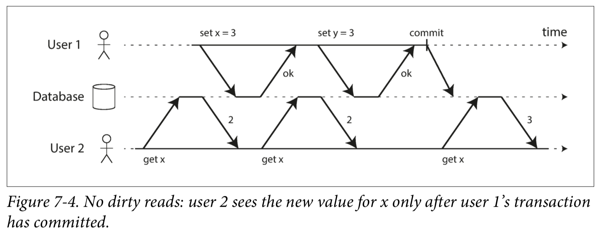

# 数据库事务

## 事务的四个特性

数据库事务，简单来讲，就是把一堆的数据库操作（增删改查）组合成一个操作，这个操作要么成功，要么失败，如果成功，那么结果
就被更新到数据库中，如果失败，那就回滚，好像从来没有对数据进行操作过一样。

谈到事务，就一定会谈到事务的四个特性：ACID。

- A：原子性。这个词语有点被滥用。在事务的特性中的意思是，整个事务就像一个原子操作，要么成功，要么失败：不成功，便成仁。
- C: 一致性。一致性的意思其实是要保证数据的正确性，这其实更是由于应用来保证而不是数据库，毕竟如果写入的数据就是错的，数据库也没办法。
- I：隔离性。这是指，多个事务之间互相不影响。
- D：持久性。这是指，当事务完成之后，所做的变更应当持久化下来，也就是说，数据不会丢失。

## 事务隔离的四个级别

事务的隔离有四个级别：

- 串行化：这是最高的隔离级别，事务一个接着一个执行，这样有一个缺点就是性能低，具体取决于实现，但是无论是单线程执行，
还是加锁来保证，由于要保证事务的执行顺序和收到请求的顺序一致，并且等待一个事务完成才执行下一个，性能会及其低下，并且受应用影响。

- 可重复读：只要事务还没有结束，读取同一行数据就会得到相同的结果。这就是可重复读这个级别所做的保证，通常来说，可重复读已经
够了，但是还是有一种情况会出现“幻读”：

- 提交读：事务只可以读到已经提交的数据。

这样不会出现脏读，但是会出现脏写：

- 未提交读：这个级别最不靠谱，尚未提交的数据就能被其他事务读到，就会出现脏读。

## MVCC

MVCC是多版本控制的意思，粗略来讲，实现方式就是对于每一行数据，如果发生了变更，那么会记录下老版本的数据，例如，原本数据
的值是A，版本是1，假设数据库里保存为A（1）。当变更为B时，数据库里保存的是A（1），B（2）。有两个问题：

- 长久下去无用的老的值越来越多会不会占空间？会，所以要进行GC。
- 索引怎么更新？索引也保存多个版本的值，当数据进行GC的时候，索引一起GC。还有一种方式就是，使用Append Only B-Trees，即，
每次写入B树的时候，都创建一个新的B树root节点，并且把要更新的节点和它的父节点拷贝过去，没有变的值保持不变。

--------

- https://zh.wikipedia.org/wiki/%E6%95%B0%E6%8D%AE%E5%BA%93%E4%BA%8B%E5%8A%A1
- 《Design Data Intensive Application》
- https://zh.wikipedia.org/wiki/%E4%BA%8B%E5%8B%99%E9%9A%94%E9%9B%A2#%E9%9A%94%E7%A6%BB%E7%BA%A7%E5%88%AB
- https://en.wikipedia.org/wiki/Multiversion_concurrency_control
