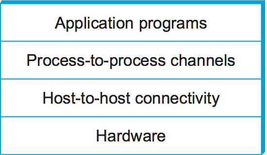
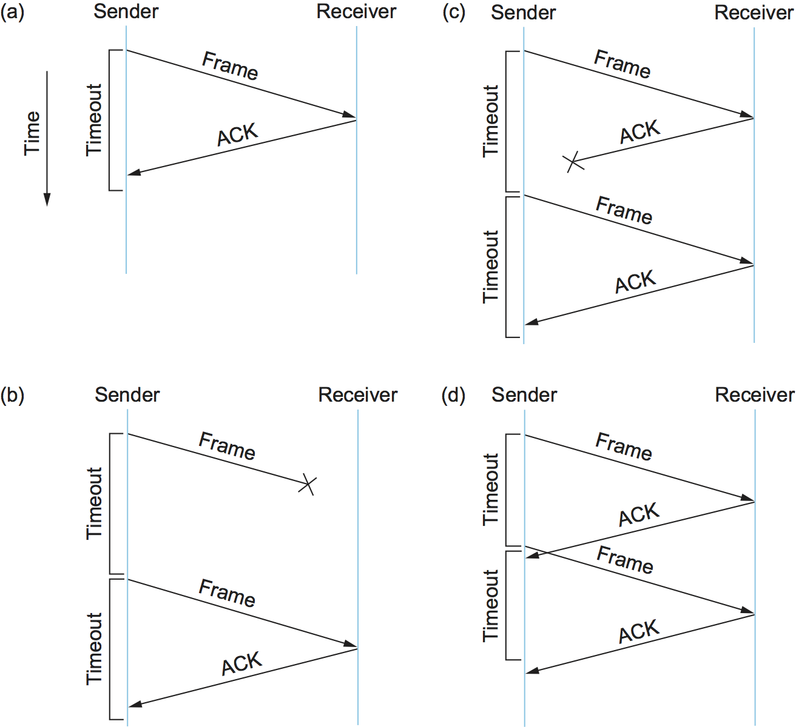
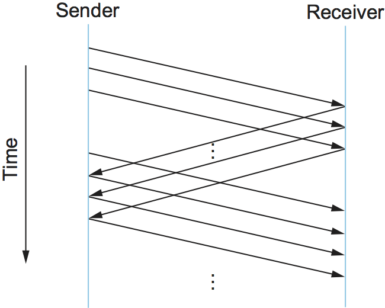

# 《计算机网络-系统方法》读书笔记

> https://book.systemsapproach.org/

- 网络设计者需要考虑的三个主要问题：
    - bit层面，可能发生 bit errors。即1变成0，0变成1等等。
    - packet层面，可能产生丢包等等。
    - 网络链路层面，可能发生链路故障，例如光纤被狗咬了。

- 网络分层：

    - OSI七层
    - TCP/IP四层

- API：
    - 首先使用 `int socket(int domain, int type, int protocol)` 创建一个socket
    - 接下来，如果是服务端：
        - `int bind(int socket, struct sockaddr *address, int addr_len)`
        - `int listen(int socket, int backlog)`
        - `int accept(int socket, struct sockaddr *address, int *addr_len)`
    - 如果是客户端：
        - `int connect(int socket, struct sockaddr *address, int addr_len)`
    - 建立连接之后，无论是客户端还是服务端，都用这两个函数写入或者读取数据：
        - `int send(int socket, char *message, int msg_len, int flags)`
        - `int recv(int socket, char *buffer, int buf_len, int flags)`
    - 最后，使用 `close` 关闭socket

- 衡量网络性能的两个指标：带宽(bandwidth/throughput)，延迟(latency/delay)。

- 网络设计者面临的五个问题：编码/解码，分帧，错误检测，可靠交付，多样性传播(access mediation)

- 可靠性交付：靠ACK。有两种模式：
    - stop and wait

    

    - 滑动窗口

    
