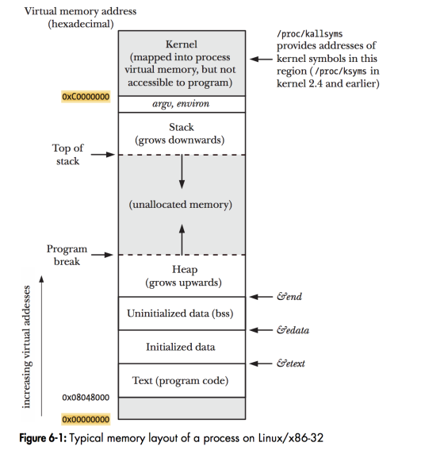
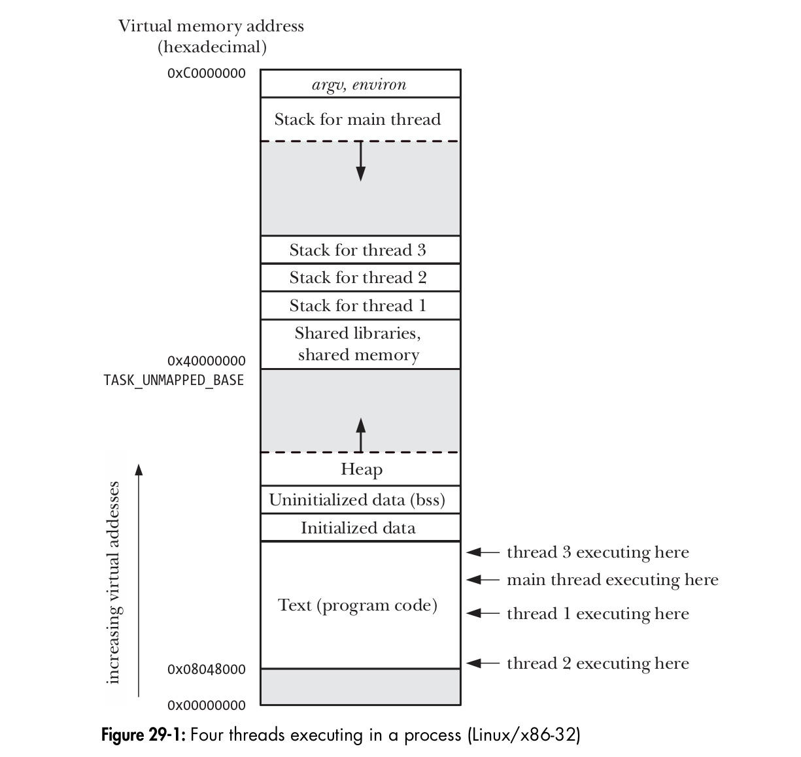

# 聊一聊goroutine

Golang，除去繁琐的 `if err != nil` 之外，写起来还是非常爽的。而goroutine作为Golang的 core feature，就是能让我们爽的根本原因之一，仔细的了解一下goroutine，怎么来说都不为过。所以，聊一聊goroutine，希望能给读者带来一些启发。

> TL;DR 我们最开始从组装一台电脑说起，然后会讲到操作系统的一些概念例如进程，线程，之后再了解一下goroutine本身。

## 组装一台电脑

我们不看笔记本，我们看台式机。回忆一下，日常常见的台式机由哪些东西组成？显示器，键盘鼠标，再加上一个主机，对不对？我们要再深入的了解一下主机，主机里，少不了这么几个东西：主板，CPU，显卡（一般土豪都会买独立显卡，我们穷人一般就用CPU自带的集成显卡了 :( ），硬盘，内存条。

CPU和内存条，我们要仔细看看。先来看CPU的示意图：


CPU是怎么工作的呢？CPU就是一二傻子，它有一个固定的指令集，我们从指令集里挑出一些指令，排好序，给它，然后它就会执行，叫它往东就往东，叫它往西就往西。CPU有这么两个东西组成：运算器，控制器。然后这两个东西包含了一堆的组件，例如各个专用的寄存器。

我们来看看 `1 + 1 = 2` 它是怎么做的：

- 从内存取出1，放到其中一个寄存器A
- 从内存取出另一个1，放到其中一个寄存器B
- 执行加法运算，把结果写入到寄存器A
- 把寄存器A中的结果拷贝到内存中存储结果的地方

我们再看看字符串相加 `hello + world = helloworld` 是怎么做的：

- 从内存中取出字符串 "hello"，算出长度5
- 从内存中取出字符串 "world"，算出长度5
- 把两个长度相加，在内存中找一块合适大小的内存somewhere
- 把 "hello" 拷贝到somewhere的第0-5个坑位
- 把 "world" 拷贝到somewhere的第6-10个坑位
- 返回找到的内存somewhere的地址

CPU具体执行的时候是不是这么做的？从具体的层次来说，不是，因为它在操作的都是一坨一坨的0和1，是我们把0和1分成了组，赋予了它们意义。但是从抽象的层次来说，是，所有的冯诺依曼体系机都这么干，包括具体的CPU架构例如Intel系，ARM系等等，也包括虚拟机例如JVM，Python中 `eval.c` 里那个巨大的 `switch...case...`等等（因为虚拟机就是模拟实体CPU呀）。

现在我们知道了CPU是咋工作的。接下来我们看看操作系统的一些概念。

## 装个系统

要装系统了，好紧张。三下五除二，就装了个Linux。可是，为什么要操作系统呢？如果没有操作系统，那程序员可就难过了，我们的日子会是这样：

- 研究一下我买的CPU的指令集，熟读手册
- 读一下硬盘的前面512字节，看下硬盘分区哈
- 我要的程序在1024个字节开始，把它们全部装到内存里
- WTF？内存太小了，不够装，我先装一部分进去
- 我要算个1+1=2
- 先取出1放寄存器A
- 再取出1放寄存器B
- 算出1+1=2，放回寄存器A
- 把寄存器A的值放到内存里
- WTF？不小心写错地方了，把我另外一个程序给干掉了
- 重启！来过。。。

如果真是这样，我就不干这一行了。幸好过去的几十年里，那些伟大的程序员们已经写出了操作系统，要不然今天我们的日子得多难过啊。

如上面我们所说，其实我们的程序都是存在硬盘里，为了运行它，我们需要把程序从硬盘读取到内存里，然后执行具体的指令。如果是我写操作系统，那肯定要找个东西把一个程序的所有信息放在一起，方便管理，就这么写:

```go
type process struct {
    instructions unsafe.Pointer; // 指令
    instruction_size int64; // 指令大小
    current_offset int64; // 当前执行的指令
};
```

这就是进程，我们来看看进程在Linux里的内存布局：



但是呢，后来人们发现，进程好像还是大了点，于是就有了线程这个概念，这是线程在Linux里的内存布局：



我们只讲解一下进程的内存布局，线程的内存布局读者自行理解。看看进程的内存布局图里，那几个概念：

- text: 这就是上面的 instructions，就是我们的代码，编译之后产生的指令
- data: 就是代码里就初始化好了的变量，例如 `int i = 1`
- bss: 就是代码里没有初始化的变量，例如 `int a`
- heap: 堆嘛，待会儿讲
- stack: 也待会儿讲

我们先来想想，为什么需要栈。栈这个数据结构的特点就是，后进先出，先进后出。函数调用的时候就是这样的，对吗？例如：

```go
func foo() {
    println("foo")
}

func main() {
    foo()
}
```

这段代码的执行顺序，肯定是先执行main，然后执行foo，然后执行println，然后println返回，然后foo返回，然后main里没有其他代码了，也返回。

看到没有？main是最先被调用的函数，但是它是最后返回的（runtime里的其他代码我们暂时先忽略）。函数调用栈里，每一次函数调用，会放在一个数据结构里，叫做帧(frame)。

我们来还原一下上述函数调用过程（在内存中的样子）：

- 首先是runtime里的某个函数调用main函数：

    ```
    | runtime | main
    ```

- 然后是main函数调用foo：

    ```
    | runtime | main | foo
    ```

- 然后是foo函数调用println：

    ```
    | runtime | main | foo | println
    ```

- 然后是println返回：

    ```
    | runtime | main | foo
    ```

- 然后是foo返回：

    ```
    | runtime | main
    ```

- 然后是main返回：

    ```
    | runtime
    ```

可以看得出来，函数返回之后，函数里本来有的变量啊什么的，就没了（其实还有，但是一般正经点的程序都不会再去访问）。那，如果我们有一些东西，不希望在某个函数返回之后就没了呢？也就是说，我们希望有一部分数据，能够与函数调用的生命周期无关。这个时候，就需要我们的堆了。

堆，就是这样的存在，什么代码申请的内存会在堆里呢？如果是C代码，那么 `malloc` 申请的内存就会在堆里，如果是Golang，那么进行逃逸分析之后，类似：

```go
func open(name string) (*os.File, error) {
    f := &File{}
    return f
}
```

中的f就会被分配在堆里。为啥？如果f分配在栈里，open这个函数返回之后，f就没了啊，那调用者还怎么愉快的使用呢？了解了这些，我们接下来就看看goroutine。

## goroutine

Golang最开始是用C写的，之后用Golang实现了自举。我们想想，如果是自己实现goroutine该要怎么实现？

敲袋麻袋！goroutine是什么？这个还没搞清楚呢。goroutine是Go里的coroutine，关于什么是coroutine，可以看 [这里](https://jiajunhuang.com/articles/2018_04_03-coroutine.md.html)，简单讲，协程就是由用户调度而不是操作系统调度的最小执行单元，我们都知道，线程是操作系统调度的最小单元，协程就是程序员手动调度的最小执行单元，有点像函数调用，区别在，多个协程可以保存现场，而函数调用，一旦函数退出，现场就没了。

所以我们肯定不能用操作系统给我们分配的栈对吗？但是函数执行又必须有栈，因此，我们在堆里申请一块内存，然后把它当作栈来用，不就ok了？这就是goroutine的结构体长这样的原因：

```go
type g struct {
        // Stack parameters.
        // stack describes the actual stack memory: [stack.lo, stack.hi).
        // stackguard0 is the stack pointer compared in the Go stack growth prologue.
        // It is stack.lo+StackGuard normally, but can be StackPreempt to trigger a preemption.
        // stackguard1 is the stack pointer compared in the C stack growth prologue.
        // It is stack.lo+StackGuard on g0 and gsignal stacks.
        // It is ~0 on other goroutine stacks, to trigger a call to morestackc (and crash).
        stack       stack   // offset known to runtime/cgo
        stackguard0 uintptr // offset known to liblink
        stackguard1 uintptr // offset known to liblink

        _panic         *_panic // innermost panic - offset known to liblink
        _defer         *_defer // innermost defer
        m              *m      // current m; offset known to arm liblink
        sched          gobuf
        ...
}
```

而Golang实现goroutine用的 [GMP架构，可以在这里读到](https://jiajunhuang.com/articles/2018_02_02-golang_runtime.md.html)，我就不再打一遍了。

上面我们说了，冯诺依曼体系机，都离不开这些个东西，什么栈啊堆啊，要实现状态转移，就得有这些东西或者类似的东西。既然goroutine是一个程序员可以调度的最小单位，那它就应该有自己的栈和堆。堆，各个线程可以共享进程的堆，栈，线程的栈大家没法在一起使用，所以我们在堆里申请一块内存，当栈用。这就是goroutine了。

---

- The Linux Programming Interface
- Advanced Programming in UNIX Environment
- 编码，隐匿在计算机软硬件背后的语言：https://book.douban.com/subject/4822685/
- https://zh.wikipedia.org/wiki/%E4%B8%AD%E5%A4%AE%E5%A4%84%E7%90%86%E5%99%A8
- https://software.intel.com/zh-cn/articles/book-processor-architecture_cpu_function_and_composition
- https://jiajunhuang.com/articles/2018_02_02-golang_runtime.md.html
