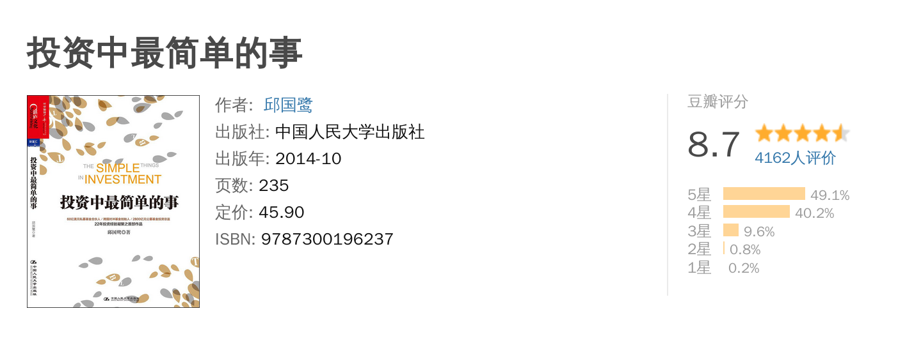

# 读《投资中最简单的事》

最近读了这一本《投资中最简单的事》，作者也是坚定的价值投资者。信奉价值投资的人，说来说去其实就是这一个词语：安全边际。
其它还有很多著名的话，例如：要找简单易懂的公司。投资一个企业，其实跟你做企业一样，如果一个企业的业务不是简单易懂的，那么很可能里面有很多说不清楚的东西。

此外，此书中所讲的投资，其实对于技术人也是一样的有用。例如，技术中也有 `simple is better`，年轻人选择一门技术的时候，也要考虑清楚这门技术当前处于什么阶段？是一统天下，还是百花齐放。前者意味着这门技术的稳定性，稳定性也就是，随着经验的增长，
你的价值会随之提升；而后者就是竞争，例如2015-2018年的前端技术，百花齐放，一门新技术出来之后，可能不到半年就消失了。

在年轻的时候竞争是一件好事(造轮子能提升技术)，但是实际上随着人的年龄的增长，是很难维持高强度的竞争的（因为还有家庭等），长远看来，选择一个竞争力随着年龄提升而提升的职业是明智的(技术中也有此类岗位)。

最近有一句话很流行，选择比努力更重要，的确如此，如果你使劲的方向错了，那么再怎么使劲，都是枉费工夫。

投资金融是一种投资，投资人生也是一种投资。在金融上需要价值投资，人生也是一样。

---

以下是读书笔记：

- 怎么成为优秀的基金经理？第一，把客户的钱当作自己的钱来珍惜；第二，把二级市场的股票投资当作一级市场的实业投资来分析。

- 如果用自己的钱做实业投资，首先要考虑的问题就是：这是不是一门好生意。用自己的钱做实业投资要考虑的第二个问题，就是这门生意的现金流状况如何，毕竟做生意的最终目的是赚取现金流。用自己的钱做实业投资要考虑的第三个问题就是行业的竞争格局以及公司是否具有比较优势。

- 长期牛股什么行业易出长期牛股？行业集中度持续提高的行业。因为这样的行业有门槛，有先发优势，后浪没法让前浪死在沙滩上，易出大牛股。相反，如果行业越来越分散，说明行业门槛不高，既有的领先者没有足够深的护城河来阻止追赶者抢夺其市场份额，这种行业一般是城头变幻大王旗，各领风骚两三年。

- 好公司的两个标准一是它做的事情别人做不了；二是它做的事情自己可以重复做。前者是门槛，决定利润率的高低和趋势；后者是成长的可复制性，决定销售增速。如果二者不可兼得，宁要有门槛的低增长（可持续），也不要没门槛的高增长（不可持续）。门槛是现有的，好把握；成长是将来的，难预测。

- 互联网“人生人”主要靠两条：一是网络效应（例如淘宝，买家多卖家就多，卖家多买家更多；社交网站，美女多帅哥就多，帅哥多美女更多），二靠人多提升用户体验（用户越多搜索结果越精确；用户越多，对餐厅的点评越靠谱）。

- 寡头垄断行业的利润增长往往不断超出预期，而市场集中度低的行业则常常陷于恶性竞争和价格战的泥潭之中。

- 逆向投资是最简单也最不容易学习的投资方式，因为它不是一种技能，而是一种品格——品格是无法学习的，只能通过实践慢慢磨炼出来。投资领域的集大成者大多数都具有超强的逆向思维能力，尽管他们对此的表述各不相同。乔治·索罗斯说：“凡事总有盛极而衰的时候，大好之后便是大坏。”约翰·邓普顿说：“要做拍卖会上唯一的出价者。”查理·芒格说：“倒过来想，一定要倒过来想。”卡尔·伊坎说：“买别人不买的东西，在没人买的时候买。”巴菲特说：“别人恐惧时我贪婪，别人贪婪时我恐惧。”
    - 首先，看估值是否够低、是否已经过度反映了可能的坏消息。
    - 其次，看遭遇的问题是否是短期问题、是否是可解决的问题。
    - 最后，看股价暴跌本身是否会导致公司的基本面进一步恶化，即是否有索罗斯所说的反身性。 “人多的地方不去”

- 独立思考、逆向而动效果往往更好。

- 把选股范围基本限制在低估值的大盘蓝筹里，以此躲过中小盘中的许多地雷。

- 逆向投资并非一味与市场作对，因为市场在大多数时候是对的。但有的时候市场也可以错得很离谱，此时就不必在意市场的主流观点了。在大多数时候，真理在大多数人手里；在少数时候，真理在少数人手里。如何区别这两种情况呢？一般说来，趋势的初期和末期，就是真理在少数人手里的时候。

- 买早了还得熬得住，这是逆向投资者的必备素质。

- 投资中影响股价涨跌的因素是无穷无尽的，但是最重要的其实只有两点，一个是估值，一个是流动性。

- 公司有四种：好的、平庸的、烂的、看不懂的；股票也有四种：被低估的、合理的、被高估的、估不准的。人的知识、时间、精力都是有限的，因此看不懂的公司占了一大半。在看得懂的公司中，估不准的又占了一大半。看得懂又估得准的，被高估的占了一大半。看得懂、估得准又没被高估的，烂公司占了一大半。剩下的股票中，合理价位的平庸公司又占了一大半。所以，一般情况下能找到被低估的平庸公司或合理价位的好公司已属不易，能买到被低估的好公司更是难上加难。可惜的是，当市场涌现大批被低估的好公司时，大家一般都在忙着斩仓。

- 所谓的投资，就是牢牢抓住这个定价权。就像茅台，整天在涨价，日子太好过了，怎么提价都有人买，为什么呢？就是有这个定价权。而我们会发现另一些企业，比如钢铁和化工，总是没有定价权，稍微涨一点钢价得到的利润就被铁矿石涨价给赚走了。行业太分散，而且产品没有差异化，没有差异化就没有定价权，除非你是垄断企业。

- 选股票，一定是先选行业。就像买房子，一定是先看社区，社区不行，房子再漂亮也不行。买股票也是，股票本身再好，只要这个行业不好，一样很难涨起来。买房子先选社区，买股票先选行业，那么什么样的行业是好行业呢？很简单，有门槛、有积累、有定价权的那种行业。

- 比如创业，要先判断这个行业，我能不能搞得动。（以我一人之力）搞得动，说明还是行业初期，是跑马圈地的时候；搞不动，说明已经瓜分天下了。对于创业，前者是好的；对于投资，后者是好的。 这和一个年轻人在选择行业的时候，一定是找那种有积累的行业一个道理。比如投资就是有积累的行业，一个做过十年的投资人和只做过一年的就是不一样，因为他见过大风大浪，刚从学校出来的小伙子不管多聪明就是没有经验，所以说一定要在有积累的行业。

> 投资技术的时候也是一样，要选择老牌的，历史悠久并且仍然健在的技术，例如算法、网络、UNIX等，而不是选择新兴的，例如比特币。但是赚钱的时候，则要反过来。

- 通胀环境下买什么股票好？常见的答案是资产资源类股票，因为投资者可以直接受益于价格上涨。更好的答案也许是那些有定价权的公司：通胀时他们可以提价，把成本压力转嫁给下游；通胀回落时，他们不必降价就享受更高的利润率。这些公司包括食品饮料等品牌消费品和工程机械、核心汽配、白色家电等寡头垄断的高端制造业。

- 从投资者的角度来看，有霸王条款的公司就是好公司，因为这说明他有定价权。有的公司服务姿态很低，很辛苦却赚不到钱，原因是竞争太激烈了。我们要找行业竞争不激烈、赚钱很容易的公司。这种行业和公司确实存在，但是不多，大概有 5 ~ 10个行业有这样的公司。长期来看，这样的公司赚钱的概率大得多。

- 谁都能做管理层的公司就是好公司。

- 过去十年是涨还是跌跟今后会涨还是会跌过去十年是涨还是跌跟今后会涨还是会跌，其实并不一定相关，关键是这个东西是不是物有所值。

- 我一直觉得一定要一分为二地看待投资的风险：一种风险是本金永久性丧失的风险，一百万投进去，之后损失了十万、二十万，再也不回来；还有一种是价格波动的风险，可能短期会跌但也会涨回来，波动的风险是投资者必须承担的。所以永久性亏钱只有两个原因，一个是市盈率的压缩。另一个是利润在历史高点的时候，夕阳行业就有本金永久性丧失的风险。

- 做投资真正想赚到比别人更多的收益，就要保持一个判断的独立性。

- 规律是可重复的，而个例是难以复制的，这就是二者的最大区别。个例令人景仰，但往往难以复制，顺着规律选股才能提高成功率。

- 一个东西只要足够便宜，赚钱的概率就会高得多。我一直喜欢引用沃尔玛的山姆·沃尔顿说的一句话：“只有买的便宜才能卖的便宜”。他用这个理念来经营零售业，获得了巨大的成功。我认为买的便宜在投资领域要比零售领域更重要。

- 在投资分析中，简单的往往是实用的。我的投资理念很简单：在好行业中挑选好公司，然后等待好价格时买入。与之相对应的投资分析工具也同样简单。 1.波特五力分析。不要孤立地看待一只股票，而要把一个公司放到行业的上下游产业链和行业竞争格局的大背景中分析，重点搞清三个问题：公司对上下游的议价权、与竞争对手的比较优势、行业对潜在进入者的门槛。 2.杜邦分析。弄清公司过去 ５年究竟是靠什么模式赚钱的（高利润、高周转还是高杠杆），然后看公司战略规划、团队背景和管理执行力等是否与其商业模式一致。例如，高利润模式的看其广告投入、研发投入、产品定位、差异化营销是否合理有效，高周转模式的看其运营管理能力、渠道管控能力、成本控制能力等是否具备，高杠杆模式的看其风险控制能力、融资成本高低等。 3.估值分析。通过同业横比和历史纵比，加上市值与未来成长空间比，在显著低估时买入。

- 不要为普通公司付太贵的价钱

- 选一个好行业是成功投资的基本条件。

- 公司的品质好坏，关键是看能不能具有定价权。对品质的判断，第二个要注意的是差异化竞争和同质化竞争的区别。

- 一个成功的投资者应该能够把行业到底竞争的是什么说清楚，把这个行业是得什么东西得天下弄明白。

- 对于多数人而言，对待选时的正确态度应该是避免把大量的时间花在试图“抄底”或者“逃顶”上。

- 历史上的股市见底信号 1.市场估值在历史低位； 2. M1见底回升； 3.降存准或降息； 4.成交量极度萎缩； 5.社保汇金入市； 6.大股东和高管增持； 7.机构大幅超配非周期类股票； 8.强周期股在跌时抗跌，涨时领涨； 9.机构仓位在历史低点； 10.新股停发或降印花税。

- 很多人认为，好货不便宜，便宜没好货，所谓便宜的好公司在现实中是可遇而不可求的。其实，在市场的底部区域，便宜的好公司俯拾皆是，只可惜此时往往有钱的没胆了，有胆的没钱了。

- 有几类股票容易是价值陷阱。
    - 第一类是被技术进步淘汰的。
    - 第二类是赢家通吃行业里的小公司。
    - 第三类是分散的、重资产的夕阳行业。
    - 第四类是景气顶点的周期股。
    - 第五类是那些有会计欺诈的公司。

- 换句话说，价值投资买的就是便宜的好公司，所以卖出。卖出的原因就是：公司没有想象的好；不再便宜；还有其他更好更便宜的公司。这三个理由均与是否亏损无关。

- 价值投资有其特定的适用范围和条件，清楚地认识到价值投资的局限性是成功投资的必径之道。
    - 价值投资的第一个基本条件：所买的公司的内在价值应该是相对容易确定的。
    - 价值投资的第二个基本条件：所投资的公司的内在价值应该相对独立于股票价格。
    - 价值投资的第三个基本条件：要在合适的市场阶段采用。
    - 价值投资的第四个基本条件：选取合适的投资期限。
