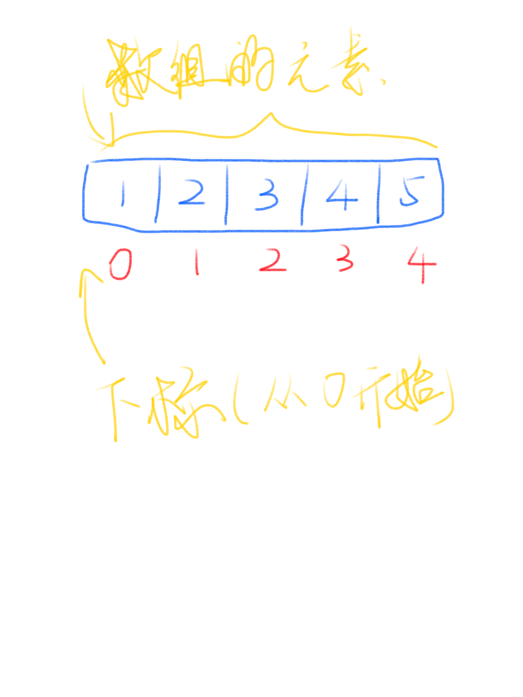
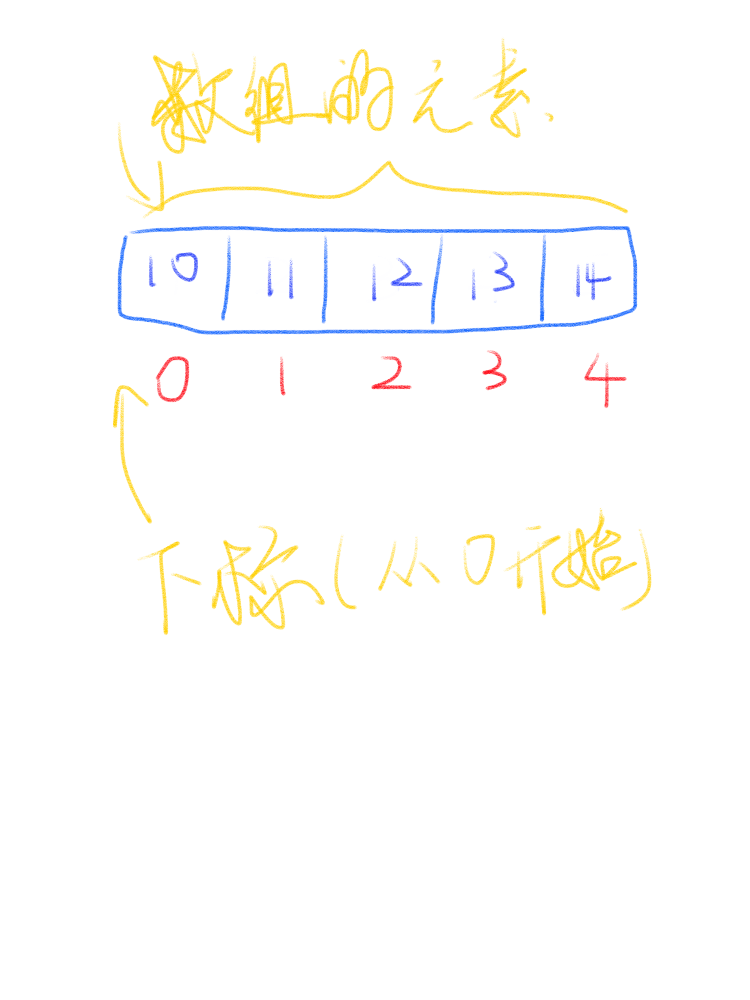

# 数组(array)

数组是最常用的一个基础数据结构，数组主要是用来存放一连串的同类型的数据，例如 `1, 2, 3, 4, 5` 或者 `a, b, c, d, e`。但是
不能存放不同类型的数据，主要原因是数组的每一个元素的长度都是固定的，而且数组的元素可以通过一个下表来找到，这个下标我们
一般称之为 `index`。例如有这么一个数组(Go语言) `a []int = {1, 2, 3, 4, 5}`，而Go语言中，下标是从0开始的，也就是说是这样：



我们可以看到，数字1的下标却是0，数字2的下表却是1，看起来有点迷惑，但是使用这个例子只是想说明，数组的元素的值，与其下标
的值是无关的，同样我们可以看到，这个数组是这样的：



可以看到，数字10的下标是0，而数字11的下标是1，因此我们知道，对于数据来说，无论数组里的元素是什么，他们的下标都是从0开始(对于
绝大部分语言来说，下标都是从0开始，例如我们会使用到的C，Go和Pyhon)。

> 注意，我们说数组存储的是一连串的内容，指的是他们在内存空间上是连续的，而不是他们的值是连续的，可以有这么一个数组：1, 3, 5, -7, -1
> 这也是一个合法合规的数组。不过值得说明的是，在真正的内存空间布局上，他们也未必是连续的，原因是现代计算机都使用了分页和虚拟内存技术，
> 但是对于应用程序来说，他们仍然是连续的虚拟内存地址。如果看不懂后面这一句话，没有关系，在这份教程里，我们就简单的当作
> 内存是连续的吧！

接下来我们看看Go语言里，我们如何使用数组。

## 数组的使用

这是Go语言里使用数组的一个例子，在C语言里是类似的用法，而Python并没有内置的数组。数组在现有的语言里，基本上都有这两个
特征：

- 固定长度
- 支持根据下标来获取元素

```go
package main

import (
	"fmt"
)

func main() {
	var intArray = [3]int{1, 2, 3}

	fmt.Printf("%d", intArray[2])
}
```

例如 `intArray[2]` 就是获取第3个元素，为什么是第三个元素呢？因为我们的下标是从0开始的。有可能你见过 "数组访问很高效" 这种
说法，这是为什么呢？

举个例子，如果是你来实现 `intArray[2]` 这个操作你会怎么实现呢？可能你的做法是从 `intArray[0]` 开始访问，一直到 `intArray[2]`
为止，然后输出 `intArray[2]` 的值，如果这个数组比较大，例如有1000000个元素，那么就要访问1000000次才能得到想要的结果，看起来
这种做法一点都不高效，的确他们不高效。

真正的做法是，注意到我们描述数组的时候，我们说数组是一个一连串同类型的数据，那么，如果我们知道第一个元素的地址，而我们又已经知道
下标是多少，因此我们可以直接计算出对应元素的位置，然后将对应位置的值取出来便可以，因此，即便是这个数组比较大，有1000000个
元素，我们也只需要三步就可以拿到结果：1. 获取数组第一个元素的位置；2. 计算出所取元素的位置；3. 根据位置获取元素的值。


## 数组在实际项目中的使用

数组在实际项目使用中，最大的问题莫过于，长度是固定的，这就意味着我们每次都要判断当前长度是否还能追加元素。而实际上，现代语言
里，大家更常用的是变长数组，Go语言里叫做slice，Python里叫做list。

那么要怎么才能实现变长数组呢？答案是使用数组。我们来看看Go语言中slice的实现：

```go

```

这是其中一个例子，此外数组还经常在算法中使用，例如，二分查找，堆排序，等等，这些算法都会用数组来作为存储数据的地方，我们来
看看二分查找是怎么进行的：

> 二分查找就是在一个已经拍好序的数组里，利用已经拍好序的这个特性，一次缩小一半的查找范围，详见维基百科词条。

```go
func Search(n int, f func(int) bool) int {
	// Define f(-1) == false and f(n) == true.
	// Invariant: f(i-1) == false, f(j) == true.
	i, j := 0, n

	for i < j {
		h := int(uint(i+j) >> 1) // avoid overflow when computing h
		// i ≤ h < j
		if !f(h) {
			i = h + 1 // preserves f(i-1) == false
		} else {
			j = h // preserves f(j) == true
		}
	}

	// i == j, f(i-1) == false, and f(j) (= f(i)) == true  =>  answer is i.
	return i
}
```

## 总结

这一篇中我们首先介绍了什么是数组，然后了解了数组的特征特性，最后看了两个实际项目中使用数组的例子：

- Go语言中slice的实现
- 二分查找中使用数组来存储数据

---

参考资料：

- [维基百科 数组 词条](https://en.wikipedia.org/wiki/Array_data_structure)
- [维基百科 二分查找 词条](https://en.wikipedia.org/wiki/Binary_search_algorithm)
- [Go语言标准库中二分查找实现](https://golang.org/src/sort/search.go)
